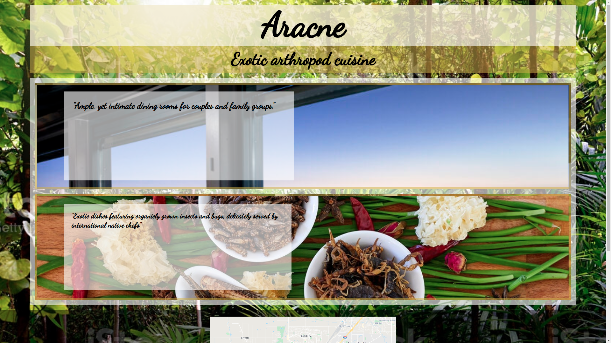

# Project Name

> This project corresponds to the Restaurant solo project for Javascript.

Features:
- Pictures, as standalone img tags and backgrounds.
- Fonts from Google Fonts
## Built With

- JavasCript
- HTML5
- SASS/SCSS
- Webpack

## Live Demo

[Live Demo Link](https://livedemo.com)

## Getting Started

You can get a local copy by cloning [this repository](https://github.com/RokoVarano/Restaurant/tree/develop)

### Prerequisites
This project requieres Javascript, SASS, NODE.js and webpack

### Setup
- Clone the project
- Go to the Clone's directory
- Run npx webpack serve
- in your browser, go to localhost:8080
### Usage
There are no available links or interactive features. However, the page is responsive at 720px width.
### Run tests
No available tests
## Authors

👤 **Rodrigo Ibaceta**

- GitHub: [Rodrigo Ibateca](https://github.com/RokoVarano/)
- Twitter: [@Rodrigo](https://twitter.com/RodrigoIbacet11)
- LinkedIn: [LinkedIn](https://www.linkedin.com/in/rodrigo-ibaceta-a8657611a/)
## 🤝 Contributing

Contributions, issues, and feature requests are welcome!

Feel free to check the [issues page](https://github.com/RokoVarano/Restaurant/issues).

## Show your support

Give a ⭐️ if you like this project!

## Acknowledgments

- Hat tip to anyone whose code was used
- Inspiration
- etc

## 📝 License

This project is [MIT](./MIT.md) licensed.